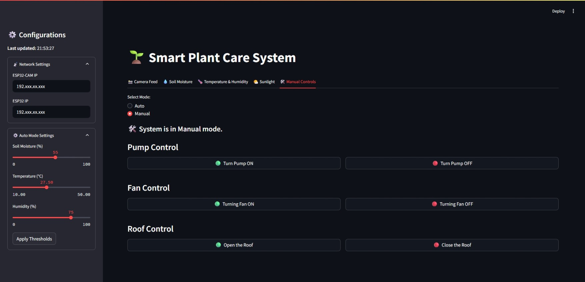

# 🌱 Smart PlantCare IoT-Based System

An IoT-based system for automated plant care, featuring real-time monitoring, disease detection and remote control with an interactive web dashboard


## Table of Contents

- [🚀 Features](#features)
- [🛠️ Hardware Used](#️hardware-used)
- [🖼️ Prototype Images](#prototype-images)
- [🖥️ UI Overview](#ui-overview)
- [⚡ Setup Instructions](#setup-instructions)
- [🧠 Disease Detection Model](#disease-detection-model)


## Features

- **Real-time Monitoring**: Soil moisture, temperature, humidity, and sunlight exposure visualized with live charts
- **Live Camera Feed**: ESP32-CAM streams live plant images to the dashboard
- **Plant Disease Detection**: Real-time disease prediction using a trained deep learning model
- **Automated & Manual Modes**: Switch between automatic and manual control
- **PCB Soldered**: All sensors and actuators are soldered onto a custom PCBs for replaceability
- **Battery Powered**: Both ESP32 and ESP32-CAM are powered by rechargable batteries, along with all the actuators
- **Interactive UI**: Responsive dashboard built with Streamlit


## Hardware Used

- **Microcontrollers**
   - ESP32 (for sensor/actuator control)
   - ESP32-CAM (for live camera feed)
- **Sensors**
   - DHT22 (Temperature & Humidity sensor)
   - Soil Moisture Sensor
   - LDR (Light Dependent Resistor)
- **Actuators**
   - DS3218 Servo Motor (for opening/closing roof)
   - Water Pump
   - DC Motor Fan
- **Relay and Power Supplies**
   - **4-Channel Relay Module**
   - **Lithium-Ion Batteries (3.7V)** (for powering ESP32 and ESP32-CAM)
   - **DC Batteries (12V)** (for powering actuators)
   - **DC-DC Buck Converter**
- **PCB Board, Male/Female Headers, Solder**


## Prototype Images
<p align="center">
  
  
</p>


## UI Overview

- **Sidebar**: Configure network settings, thresholds, and modes.
- **Tabs**: 
  - 📸 Camera Feed: Live ESP32-CAM stream with disease detection and flash control
  - 💧 Soil Moisture: Live chart, pump status, control
  - 🌡️ Temperature & Humidity: Live readings, fan status, control
  - 🌤️ Sunlight: Sunlight detection, roof status, control
  - 🛠️ Manual Controls: Direct control of pump, fan, roof
- **Dashboard Screenshots** _(offline)_:
   
   


## Setup Instructions

Clone the repository:
```bash
git clone https://github.com/LeLuke007/Smart-Plantcare-System.git
cd Smart-Plantcare-System
```

### 1. ESP32 (Sensor/Actuator Node)

1. Open `ESP32/ESP32.ino` in Arduino IDE
2. **Set your Wi-Fi credentials:**
   ```cpp
   const char* ssid = "YOUR_WIFI_SSID";
   const char* pass = "YOUR_WIFI_PASSWORD";
   ```
3. Upload the code to your ESP32 (DOIT ESP32 DEVKIT V1)

### 2. ESP32-CAM (Camera Node)

1. Open `ESP32_CAM/ESP32_CAM.ino` in Arduino IDE
2. **Set your Wi-Fi credentials:**
   ```cpp
   const char* ssid = "YOUR_WIFI_SSID";
   const char* password = "YOUR_WIFI_PASSWORD";
   ```
3. Upload the code to your ESP32-CAM (Al Thinker ESP32-CAM)

### 3. Streamlit Dashboard

1. Install dependencies:
   ```bash
   pip install -r requirements.txt
   ```
2. Open `app.py`
3. **Set ESP32 and ESP32-CAM IP addresses:**
   ```python
   ESP32_CAM_IP = 'YOUR_ESP32_CAM_IP'
   ESP32_IP = 'YOUR_ESP32_IP'
   ```
5. Run the dashboard:
   ```bash
   streamlit run app.py
   ```


## Disease Detection Model

The plant disease detection model was trained using a deep learning approach with transfer learning.

- **Dataset**: Used the [New Plant Diseases Dataset](https://www.kaggle.com/datasets/vipoooool/new-plant-diseases-dataset) from Kaggle, containing thousands of labeled images of healthy and diseased plants
- **Model Architecture**: Used MobileNetV2 (pretrained on ImageNet) as base model, with added dense layers for classification
- **Training**: Trained using categorical cross-entropy loss and Adam optimizer, with early stopping and model checkpointing
- **Evaluation Results:**
  - **Validation Accuracy:** 92.6%
  - **Validation Loss:** 0.2250

  <div align="center">
   <table>
   <tr>
      <td align="center"><b>Confusion Matrix</b></td>
      <td align="center"><b>Accuracy-Loss Curve</b></td>
   </tr>
   <tr>
      <td></td>
      <td></td>
   </tr>
   </table>
</div>